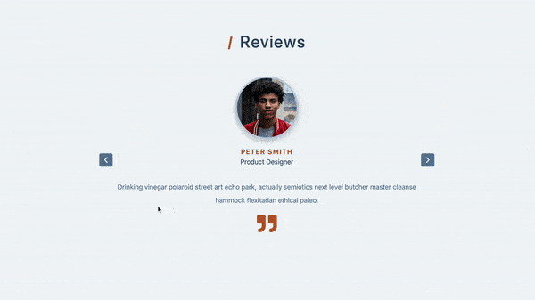

## Summary

A review of sliders with 

- Click the right/left button to show the next/previous slider.

- Use `setInterval()` to make slider automatically changes.

- If clicking the right/left buttons, clean previous `setInterval()`.



Ref: [Gatsby-Airtable Project](https://gatsby-airtable-design-project.netlify.app/)

## File structure

```
.
├── README.md
└── src
    ├── App.js
    ├── components
    │   ├── Article.js
    │   ├── ButtonLeft.js
    │   ├── ButtonRight.js
    │   └── Title.js
    ├── data.js
    ├── index.css
    └── index.js
```

## Notes

### 1. Display and only show the middle slider

Display all sliders with flex to make them in the same row and use CSS `transform: translateX();` to adjust the position of every slider.

### 2. Add class to adjust the appearance

Add class with 'lastSlide', 'activeSlide' and 'nextSlide', it represent from left, middle, and to the right.

### 3. Check the active slider with index of the data

Put all slides on the right-hand side first, when the person index matches the index state, change the class of the person index from 'nextSlide' into 'activeSlide'

### 4. Switch slider with `setIndex()`

Use `setIndex(index - 1)` and `setIndex(index + 1)` to switch the slides, and `useEffect()` to control the edge case:

```javascript
useEffect(() => {
  const lastIndex = people.length - 1;
  if (index < 0) {
    setIndex(lastIndex);
  }

  if (index > lastIndex) {
    setIndex(0);
  }
}, [index, people]);
```

### 5. Move slider automatically

`setInterval()` with index + 1 to make the slides move automatically

```javascript
useEffect(() => {
  setInterval(() => {
    setIndex(index + 1);
  }, 3000);
}, [index]);
```

### 6. If index changes, clean the `setInterval()` function

Get [Return value](https://developer.mozilla.org/en-US/docs/Web/API/setInterval#return_value) from `setInterval()` and when clicking the next or previous button, it cleared the previous `setInterval(`) by `clearInterval()`.

## Available Scripts

In the project directory, you can run:

### `npm start`

Runs the app in the development mode.\
Open [http://localhost:3000](http://localhost:3000) to view it in your browser.
